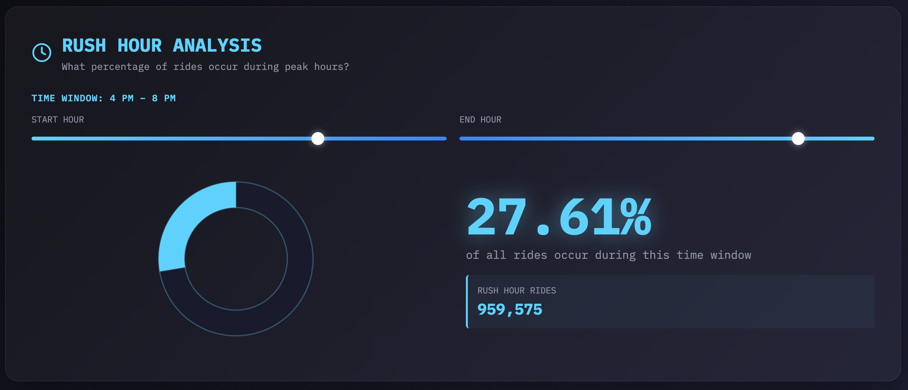

# Visualizing NYC Taxi Data with API Endpoints 🚕

An interactive, real-time analytics dashboard for NYC Taxi & Limousine Commission data, powered by Altinity.Cloud ClickHouse API Endpoints.

## 🎯 Features

This dashboard provides three interactive queries with dynamic visualizations:

###  Rush Hour Analysis

- Interactive time window slider (adjustable start/end hours)  
- Pie chart visualization showing percentage of rides during the time range you selected 
- Real-time updates as you adjust the time range  
- Displays total rides for the time range you selected

###  Tip Distribution by Distance

- Adjustable distance range slider (min/max miles)  
- Bar chart showing average tip percentage by trip distance  
- Insights into how tipping behavior varies with trip length  
- Filterable by distance brackets

###  Hottest Routes

- Top N most popular pickup/dropoff location pairs for a given borough  
- Adjustable borough name (Manhattan, Bronx, Brooklyn, Queens, Staten Island) and number of routes to display (5-25)  
- Shows trip count, average fare, and average distance for each route  
- Ranked list with smooth hover interactions

## 🎨 Design Highlights

**"Data Noir" Aesthetic:**

- Dark gradient background (deep blues and blacks)  
- Three distinct color schemes (cyan, gold, green) for each query  
- Glassmorphism cards with backdrop blur  
- IBM Plex Mono monospace font for technical feel  
- Smooth CSS animations and transitions  
- Custom-styled range sliders with glowing thumbs  
- Noise texture overlay for depth

## 🏗️ Architecture

The app uses:

- **React 18** with functional components and hooks  
- **Recharts** for beautiful, responsive data visualizations  
- **Lucide React** for crisp, modern icons  
- **Vite** as the blazing-fast dev server and build tool  
- [**Altinity Cloud API Endpoints**](https://docs.altinity.com/altinitycloud/userguide/cluster-explorer/api-endpoints-tab/) for ClickHouse queries

## 📊 Data Source

The dashboard queries NYC Taxi & Limousine Commission trip data from August-October 2025:

- Trip data files: `yellow_tripdata_2025-08.parquet`, `yellow_tripdata_2025-09.parquet`, and `yellow_tripdata_2025-10.parquet` 
  - Source: [https://d37ci6vzurychx.cloudfront.net/trip-data/](https://d37ci6vzurychx.cloudfront.net/trip-data/)
- Data to map location IDs to specific boroughs: `taxi_zones.csv`
  - Source: [https://d37ci6vzurychx.cloudfront.net/misc/](https://d37ci6vzurychx.cloudfront.net/misc/) 

## 🔌 How API Endpoints Work

The Altinity Cloud API Endpoints feature lets you run SQL statements via a traditional REST request. This web app:

The dashboard:

1. Constructs URLs based on values selected on the page 
2. Fetches data from those URLs via your API endpoints 
3. Parses JSON results 
4. Updates visualizations in real-time

NOTE: This demo uses `GET`, but you can create endpoints that use the `POST` and `DELETE` verbs as well.

## ⚡ Getting Started

See [the setup instructions](./SETUP.md) to get up and running quickly. For complete details on API Endpoints, see [the Altinity.Cloud API Endpoints documentation](https://docs.altinity.com/altinitycloud/userguide/cluster-explorer/api-endpoints-tab/). 

