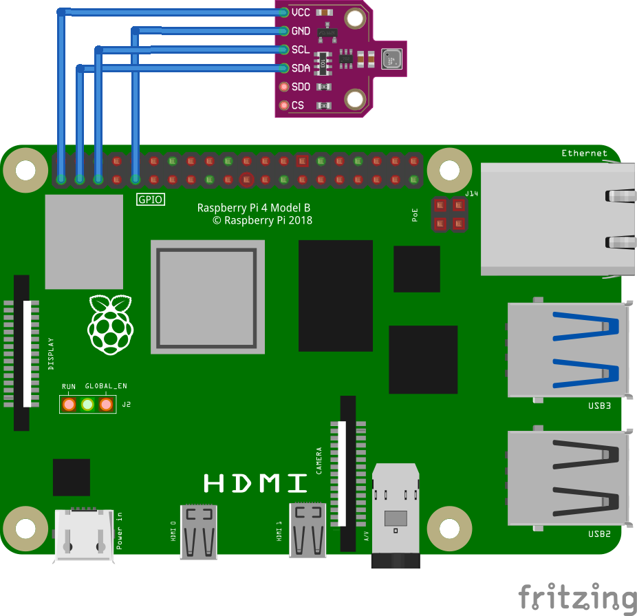

# Setup Guide: BME680 Sensor Logger for Raspberry Pi

Complete step-by-step instructions for setting up the BME680 sensor logger on Raspberry Pi to post data to ClickHouse via API Endpoints.

## Table of Contents

1. [ClickHouse Configuration](#clickhouse-configuration)
2. [Hardware Requirements](#hardware-requirements)
3. [Raspberry Pi Setup](#raspberry-pi-setup)
4. [Hardware Wiring](#hardware-wiring)
5. [Python Environment Setup](#python-environment-setup)
6. [Software Installation](#software-installation)
7. [Testing](#testing)
8. [Troubleshooting](#troubleshooting)

---

## ClickHouse Configuration

Before running the sensor code, set up your ClickHouse database and API endpoint.

### 1. Create Database and Table

Connect to your ClickHouse cluster and run:

```shell
-- Create database  
CREATE DATABASE IF NOT EXISTS maddie ON CLUSTER '{cluster}';

-- Create table  
CREATE TABLE maddie.sensor_data ON CLUSTER '{cluster}'  
(  
  time_stamp DateTime64(3),  
  temp Float32,  
  humidity Float32,  
  pressure Float32,  
  sensor String  
)  
ENGINE = ReplicatedMergeTree('/clickhouse/{cluster}/tables/maddie/sensor_data', '{replica}')  
ORDER BY tuple()  
SETTINGS index_granularity = 8192;
```

### 2. Create API Endpoint in Altinity Cloud Manager

1. Navigate to your cluster → **API Endpoints** tab
2. Click **+ ENDPOINT**
3. Configure:
   - **Method**: POST
   - **Name**: `/insert-sensor-data`
   - **Query**:

```shell
INSERT INTO maddie.sensor_data (time_stamp, temp, humidity, pressure, sensor)   
   SELECT    
   parseDateTimeBestEffort({time_stamp:String}),    
   {temp:Float32},    
   {humidity:Float32},    
   {pressure:Float32},    
   {sensor:String}
```

4. Click **SAVE ALL**
5. Wait for the "API endpoint isn't fully configured" message to disappear

### 3. Test the Endpoint

In the ACM endpoint editor, fill in test values:

- `time_stamp`: `2026-02-20 12:30:00`
- `temp`: `22.5`
- `humidity`: `45.0`
- `pressure`: `1013.25`
- `sensor`: `test-sensor`

Click **RUN**. Success = empty result (no errors).

Make sure your new data was added to the database:

`SELECT * FROM maddie.sensor_data ORDER BY time_stamp DESC LIMIT 5;`

### 4. Get Your Connection URL

In the ACM, click the **Connection Details** link and note your cluster's URL. If your URL is:

`https://your-cluster.altinity.cloud:8443`

Your full endpoint URL will be:

`https://your-cluster.altinity.cloud:8443/insert-sensor-data`

---

## Hardware Requirements

### Required Components

- **Raspberry Pi** (any model with 40-pin GPIO header):
   - Raspberry Pi 4 Model B (tested with 8GB)
   - Raspberry Pi 3 B/B+
   - Raspberry Pi Zero 2 W (tested)
   - Raspberry Pi 5
- **BME680 Sensor Breakout Board** (choose one):
   - [Pimoroni BME680 with right-angle header](https://shop.pimoroni.com/products/bme680-breakout) (easiest - plugs directly in)
   - [Adafruit BME680](https://www.adafruit.com/product/3660)
   - Generic BME680 breakout board
- **MicroSD Card** (16GB minimum, 32GB recommended)
- **Power Supply** (official Raspberry Pi power supply recommended)
- **Optional**: Jumper wires if not using Pimoroni board

### Compatible Hardware

This setup also works on:

- Nvidia Jetson Nano (see Appendix B in the blog post for details)
- Nvidia Jetson Orin Nano (untested but should work)

---

## Raspberry Pi Setup

### 1. Flash Raspberry Pi OS

1. Download and install the [Raspberry Pi Imager](https://www.raspberrypi.com/software/)

2. **Configure the Image:**

   - **Device**: Select your Raspberry Pi model
   - **OS**: Raspberry Pi OS (64-bit) - recommended
   - **Storage**: Select your microSD card
   - Click **Next**, then **Edit Settings**

3. **In OS Customization Settings:**

   **General Tab:**

   - Set hostname (e.g., `sensor-pi`)
   - Username: `demouser`
   - Password: `demopassword` (or your chosen password)
   - Configure WiFi (SSID and password)
   - Set locale settings and timezone


**Services Tab:**

- ✅ Enable SSH
- Choose "Use password authentication"
- ⚠️ No need to enable Raspberry Pi Connect

4. **Write the Image:**

   - Click "Save" → "Yes" to apply settings
   - Click "Yes" to write (this erases the SD card)
   - Wait 5-10 minutes for completion

5. **Boot the Pi:**

   - Insert SD card into Raspberry Pi
   - Connect power
   - Wait 2-3 minutes for first boot

### 2. Initial System Configuration

SSH into your Pi (replace with your Pi's IP address or hostname):

```
ssh demouser@sensor-pi.local  
# or  
ssh demouser@192.168.1.XXX
```

**Update the system:**

```shell
sudo apt update  
sudo apt upgrade -y
```

This may take several minutes.

### 3. Enable the I2C Interface

The BME680 uses I2C communication. Enable it with `raspi-config`:

`sudo raspi-config`

**Navigate through the menus:**

1. Select option 3: **Interface Options** → Enter
2. Select option I5: **I2C** → Enter
3. **Would you like the ARM I2C interface to be enabled?** → Select **Yes** → Enter
4. Press Enter at tne confirmation message
5. Tab to **Finish** → Enter

**Reboot:**

`sudo reboot`

### 4. Install System Dependencies

After reboot, SSH back in and install required the packages:

`sudo apt install -y python3-pip python3-venv git i2c-tools`

---

## Hardware Wiring

### Pin Connections

Wire the BME680 to your Raspberry Pi using these connections:

| BME680 Pin | Raspberry Pi Pin | Pin # | Description             |
| :---- | :---- | :---- |:------------------------|
| VCC (or 2-6V or VIN) | 3.3V | **1** | Power ⚠️ **NOT 5V!**    |
| SDA (or SDI) | GPIO 2 (SDA) | **3** | I2C Data                |
| SCL (or SCK) | GPIO 3 (SCL) | **5** | I2C Clock               |
| GND | Ground | **9** | Ground (or any GND pin) |

### Visual Guide



### Board-Specific Notes

**Pimoroni BME680 with right-angle header:**

- Plugs directly onto pins 1, 3, 5, 9
- No jumper wires needed!
- Labeled: 2-6V, SDA, SCL, GND

**Adafruit BME680:**

- Uses SPI terminology: VIN, SDI, SCK, GND
- Ignore SDO and CS pins (SPI only)
- VIN can accept 3.3V or 5V (has regulator) - use 3.3V for consistency

**Generic boards:**

- Usually labeled: VCC, SDA, SCL, GND
- Standard I2C pinout

### ⚠️ Critical Warning

**NEVER connect VCC to 5V (Pin 2 or 4)!** The BME680 is a 3.3V device. Using 5V will damage it permanently.

### Verify Wiring

After connecting the sensor, make sure the Raspberry Pi can find it:

i2cdetect -y 1

**Expected output:**

```shell
     0  1  2  3  4  5  6  7  8  9  a  b  c  d  e  f  
00:                         -- -- -- -- -- -- -- --   
10: -- -- -- -- -- -- -- -- -- -- -- -- -- -- -- --   
20: -- -- -- -- -- -- -- -- -- -- -- -- -- -- -- --   
30: -- -- -- -- -- -- -- -- -- -- -- -- -- -- -- --   
40: -- -- -- -- -- -- -- -- -- -- -- -- -- -- -- --   
50: -- -- -- -- -- -- -- -- -- -- -- -- -- -- -- --   
60: -- -- -- -- -- -- -- -- -- -- -- -- -- -- -- --   
70: -- -- -- -- -- -- 76 --
```

You should see `76` or `77` (BME680's I2C address).

**If you only see dashes (`--`):**

1. ⚠️ **Immediately disconnect the BME680!**
2. Check if the sensor is hot to the touch (indicates wrong wiring)
3. Verify all connections match the figure above
4. Ensure I2C is enabled (`sudo raspi-config`)
5. Try `i2cdetect -y 0` (some older Pis use bus 0)

---

## Python Environment Setup

### 1. Clone the Repository

```shell
cd ~  
git clone https://github.com/Altinity/examples.git  
cd examples/bme680_clickhouse_demo/raspberry_pi
```

### 2. Create Virtual Environment

`python3 -m venv venv`

This creates an isolated Python environment for the project.

### 3. Activate Virtual Environment

`source venv/bin/activate`

Your prompt should now start with `(venv)`:

`(venv) demouser@sensor-pi:~/examples/bme680_clickhouse_demo/raspberry_pi $`

### 4. Install Python Dependencies

```shell
# Upgrade pip first  
pip install --upgrade pip  
# Install required packages  
pip install -r requirements.txt
```

**Packages installed:**

- `bme680` - BME680 sensor library
- `requests` - HTTP client for API calls
- `python-dotenv` - Environment variable management
- `smbus2` - I2C communication

### 5. Optional: Auto-Activate on Login

To automatically activate the virtual environment when you SSH in:

`echo 'source ~/examples/bme680_clickhouse_demo/raspberry_pi/venv/bin/activate' >> ~/.bashrc`

---

## Software Installation

The code is already cloned (from Python Environment Setup above). Now configure it.

### 1. Configure Credentials

Copy the example environment file:

`cp .env.example .env`

Add your ClickHouse credentials to `.env:`

```shell
CLICKHOUSE_USERNAME=your_username  
CLICKHOUSE_PASSWORD=your_password
```

### 2. Configure Application Settings

Copy the example config file:

`cp config.json.example config.json`

Update `config.json` with your settings:

```shell
{  
  "endpoint_url": "https://your-cluster.altinity.cloud:8443/insert-sensor-data",  
  "sample_interval": 60,  
  "sensor_name": "warehouse-01",  
  "log_to_console": true,  
  "temp_adjustment": 0.0  
}
```

**Configuration Parameters:**

| Parameter | Description | Default |
| :---- | :---- | :---- |
| `endpoint_url` | Full URL to your API endpoint | (required) |
| `sample_interval` | Seconds between sensor readings | 60 |
| `sensor_name` | Unique identifier for this sensor | `warehouse-01` |
| `log_to_console` | Show console output for each reading | `true` |
| `temp_adjustment` | Temperature offset in °C (see below) | `0.0` |

**About `temp_adjustment`:**

The BME680 runs warm and may pick up heat from the Raspberry Pi. If your readings are consistently higher than room temperature, adjust this value. For example, if the sensor reads 25°C but the actual temperature is 20°C, set `temp_adjustment` to `-5.0`.

---

## Testing

### 1. Test Sensor Reading

First, verify the sensor works:

```shell
source venv/bin/activate  # If not already activated  
python test_bme680.py
```

**Expected output:**

```shell
Polling sensor (Ctrl+C to exit)  
Temp: 27.57°C  
Pressure: 1003.43 hPa  
Humidity: 17.43%  
------------------------------  
Temp: 27.56°C  
Pressure: 1003.42 hPa  
Humidity: 17.43%  
------------------------------  
Press **Ctrl+C** to exit.
```

**If the sensor test fails:**

- Verify wiring
- Check `i2cdetect -y 1` shows the sensor
- Ensure BME680 isn't hot (wrong wiring)

### 2. Test ClickHouse Connection

Test with curl (replace with your actual URL and credentials):

```shell
curl -X POST \  
"https://your-cluster.altinity.cloud:8443/insert-sensor-data?time_stamp=2026-02-20%2012:30:45&temp=22.5&humidity=45.2&pressure=1013.25&sensor=curl-test" \  
-u "username:password" \  
-H "Content-Length: 0"
```

Success = no output. Verify in ClickHouse:

`SELECT * FROM maddie.sensor_data WHERE sensor = 'curl-test';`

### 3. Run the Logger

Start the full sensor logger:

`python sensor_to_clickhouse.py`

**Expected output:**

```shell
Sensor Logger initialized successfully!  
Endpoint: https://your-cluster.altinity.cloud:8443/insert-sensor-data  
Sample interval: 60 seconds  
Sensor: warehouse-01  
Temperature offset: 0.0  
Starting sensor data collection...  
Press Ctrl+C to stop  
✓ Data sent successfully at 2026-02-20 15:10:11  
Temp: 25.19°C (raw: 25.19°C), Humidity: 30.01%, Pressure: 990.13 hPa  
✓ Data sent successfully at 2026-02-20 15:11:17  
Temp: 25.21°C (raw: 25.21°C), Humidity: 30.0%, Pressure: 990.13 hPa
```

Let it run for a few minutes, then verify in ClickHouse:

```shell
SELECT * FROM maddie.sensor_data   
WHERE sensor = 'warehouse-01'   
ORDER BY time_stamp DESC   
LIMIT 10;
```

Press **Ctrl+C** to stop the logger.

---

## Troubleshooting

### Sensor Issues

**Problem: Sensor not detected (`i2cdetect` shows only dashes)**

Solutions:

1. Verify I2C is enabled: `sudo raspi-config` → Interface Options → I2C
2. Check wiring against pinout table
3. Try alternate I2C bus: `i2cdetect -y 0`
4. Verify sensor isn't damaged (check if hot)

**Problem: Temperature reads too high**

Solution: Adjust `temp_adjustment` in `config.json`. The BME680 and Raspberry Pi both generate heat.

**Problem: Intermittent sensor failures**

Solutions:

1. Check power supply (use official Pi adapter)
2. Shorten jumper wires if using them
3. Check for loose connections

### Python Issues

**Problem: `ModuleNotFoundError`**

Solution:

```shell
source venv/bin/activate  
pip install -r requirements.txt

```

**Problem: Permission errors with I2C**

Solution:

`sudo usermod -a -G i2c $USER`

Log out and back in

### ClickHouse Connection Issues

**Problem: Authentication errors (401)**

Solutions:

1. Verify credentials in `.env`
2. Test with curl using same credentials
3. Check username has permissions in ACM

**Problem: Connection timeouts**

Solutions:

1. Verify network connectivity: `ping your-cluster.altinity.cloud`
2. Check firewall rules
3. Verify endpoint URL is correct

---

## Next Steps

- For additional security:
   - Configure the list of allowed IPs in the ACM
   - Create a user account that only has access to one database
- Monitor your data in ClickHouse
- Build Grafana dashboards to visualize sensor readings
- Add more sensors with different `sensor_name` values
- Set up alerts for temperature thresholds

## Need Help?

- Check [the main README.md](../README.md) for project overview
- Open an issue on GitHub
- Join the Altinity community Slack

---

**You're all set!** Your Raspberry Pi is now logging environmental data to ClickHouse via API Endpoints.
