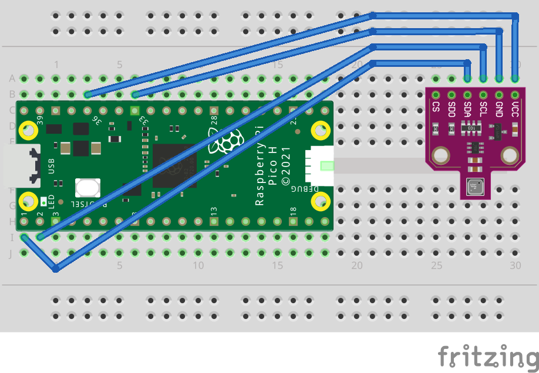

# Setup Instructions - Pico WH BME680 Logger

## Hardware Requirements

- **Raspberry Pi Pico WH** (WiFi + pre-soldered headers)
- **BME680 Environmental Sensor** (I2C breakout board)
- **LiPo Battery** (optional, for portable use - 1000-2000mAh recommended)
- **LiPo Power Supply** (optional, e.g., Pimoroni LiPo SHIM or similar)
- **Jumper Wires** for connecting sensor to Pico

## Wiring Diagram

Connect BME680 to Pico WH as follows:

```
BME680 Pin    →    Pico WH Pin
─────────────────────────────────
VIN (3.3V)    →    3V3 (Pin 36)
GND           →    GND (Pin 33)
SCL           →    GP5 (Pin 7)
SDA           →    GP4 (Pin 6)
```

## Visual Guide 


## Software Requirements

### On Your Computer (macOS/Linux/Windows)

1. **Thonny IDE** (easiest option)
   - Download: https://thonny.org/
   - Comes with built-in support for Pico
   - Alternative: rshell, ampy, or mpremote

2. **MicroPython Firmware** for Pico W
   - Download latest: https://micropython.org/download/RPI_PICO_W/
   - Choose the `.uf2` file for Pico W (includes WiFi support)

## Installation Steps

### Step 1: Flash MicroPython to Pico WH

1. Hold down the **BOOTSEL** button on your Pico WH
2. While holding BOOTSEL, plug the Pico into your computer via USB
3. Release BOOTSEL - Pico appears as a USB drive named "RPI-RP2"
4. Drag and drop the MicroPython `.uf2` file onto the drive
5. Pico will reboot automatically with MicroPython installed

### Step 2: Install Required Libraries

The Pico needs the `bme680` library for MicroPython.

1. Download bme680.py from: https://github.com/robert-hh/BME680-Micropython
2. Copy `bme680.py` to your Pico's root directory using Thonny or rshell

### Step 3: Configure the Logger

Next, configure `main.py` with the appropriate values for your environment: 

**Configuration Options:**
* `WIFI_SSID` = SSID of your wifi network 
* `WIFI_PASSWORD` = Your wifi network's password
* `CLICKHOUSE_URL` = Something like `https://example-cluster.altinity.cloud:8443/insert-sensor-data` - get this from the Connections link 
* `CLICKHOUSE_USER` = Your ClickHouse username
* `CLICKHOUSE_PASSWORD` = Your ClickHouse password
* `SENSOR_NAME` = A name for this sensor. `warehouse-01`, `loading-dock`, whatever you like
* `POST_INTERVAL` = How many seconds the script should wait before reposting data. Default is `60`. 

### Step 4: Upload Files to Pico

**Using Thonny:**
1. Connect Pico to computer via USB
2. Open `main.py` in Thonny
3. Click "File" → "Save As"
4. Choose "Raspberry Pi Pico"
5. Save as `main.py`

### Step 5: Test the Logger

**Interactive Testing (via Thonny):**
1. Open main.py from the Pico in Thonny
2. Click the green Run button (or F5)
3. Watch the shell output for connection and sensor readings
4. Press Ctrl+C to stop

You should see output like:
```
MPY: soft reboot
=== Pico WH Sensor Logger Starting ===
I2C devices found: ['0x77']
BME680 initialized!

Connected! IP: 192.168.86.176
Syncing time with NTP server (attempt 1/3)...
✓ Time synced (UTC): 2026-02-20 14:19:25

Starting measurements every 60 seconds...
Press Ctrl+C to stop

✓ Posted: 22.1ºC, 32.8% RH, 991.2 hPa 
```

## Troubleshooting

### Pico Not Showing Up as USB Drive
- Try a different USB cable (some are charge-only)
- Hold BOOTSEL longer while plugging in
- Try a different USB port

### WiFi Connection Fails
- Check SSID and password in main.py
- Ensure you're using 2.4GHz WiFi (Pico W doesn't support 5GHz)
- Check WiFi signal strength at Pico location

### Sensor Not Found
- Verify I2C wiring (SDA, SCL, VIN, GND)
- Check pin numbers in main.py match your wiring
- Try running I2C scan:

```python
from machine import Pin, I2C
i2c = I2C(0, scl=Pin(5), sda=Pin(4))
print(i2c.scan())  # Should show [0x77] or [0x76] for BME680
```

### ClickHouse POST Fails
- Verify endpoint URL is correct
- Test endpoint with curl from your computer first
- Check firewall/network settings
- Verify API key if required

### Script Crashes on Boot
- Connect via serial console to see error messages
- Temporarily rename `main.py` to prevent auto-start
- Debug interactively in Thonny

### Out of Memory Errors
- MicroPython has limited RAM (264KB)
- Reduce sensor reading frequency
- Simplify data payload
- Remove debug print statements

## Power Comparison: Pico WH vs Pi Zero 2 W

| Feature | Pico WH | Pi Zero 2 W |
|---------|---------|-------------|
| **Power (active)** | ~100mA | ~350mA |
| **Power (sleep)** | ~1mA | ~150mA |
| **Battery Life (2000mAh)** | 8+ days | 10-12 hours |
| **Boot Time** | ~1 second | ~20-30 seconds |
| **Storage** | 2MB flash | SD card |
| **OS** | None (bare metal) | Linux |
| **SSH Access** | No | Yes |
| **Complexity** | Lower | Higher |
| **Cost** | $7 | $15 |

## Additional Resources

- **MicroPython Docs**: https://docs.micropython.org/
- **Pico W Datasheet**: https://datasheets.raspberrypi.com/picow/pico-w-datasheet.pdf
- **BME680 Datasheet**: https://www.bosch-sensortec.com/products/environmental-sensors/gas-sensors/bme680/
- **Thonny Forum**: https://github.com/thonny/thonny/discussions

## Support

If you run into issues:
1. Check the serial console output for error messages
2. Verify hardware connections with a multimeter
3. Test WiFi and API endpoints independently
4. Review the troubleshooting section above
